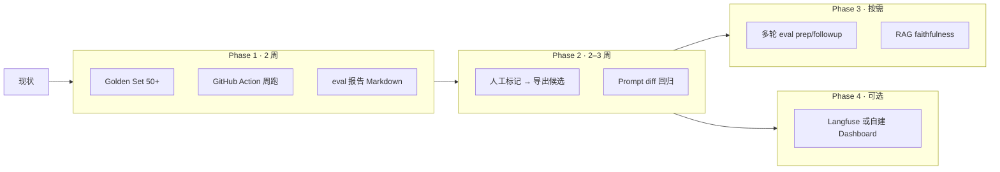

# Eval / Trace 落地路线图

> 面向 CVassistant 3.0（PM 面试训练 Agent）。基于现有 `lib/observation-trace.js`、`scripts/eval-scoring.js`、`eval/` Golden Set 与 Upstash Trace，**不引入 FirstCoder / SWE-bench** 等 coding benchmark。

## 现状（Phase 0 · 已有）

| 能力 | 位置 | 说明 |
|------|------|------|
| Golden Set 30 条 | `eval/` + `eval/评测集说明.md` | 优/中/差各 10，五维人工 rubric |
| 离线跑分 | `scripts/eval-scoring.js` | Spearman、badcase 输出 JSONL |
| Badcase 规则 | `lib/observation-trace.js` | dimension_mismatch、overall_score_delta、parse_failure、timeout |
| Token 聚合 CLI | `scripts/aggregate-tokens.js` | 日/周/月 + badcase 列表 |
| 线上 Trace | `/api/records` + Upstash | Trace 面板、练习记录（可选） |
| Context Guard | `lib/context-guard.js` | 40 轮压缩，coach/followup 护栏 |
| CI smoke | `test-trace-guard.mjs` | vercel-build 内 trace/guard 冒烟 |

**缺口**：评测集偏小、无 CI 定期回归、**线上 Trace 不会自动打 badcase**（缺人工标准分）、生产问题案例难回流 Golden Set、简历/准备模块缺独立 eval、无 hosted trace 可视化。

> **Badcase 两种语境**  
> - **离线 eval**（`eval-scoring.js`）：有 `humanScores` 时可自动打标（维度差 ≥2、均分差 ≥1.5、parse/timeout）。  
> - **线上 Trace**（真实练题）：**不会**自动知道「点评质量差」，只能可靠捕获 parse 失败 / 超时；其余需 **你或用户手动标记**。

---

## 总览



---

## Phase 1：Golden Set 与 CI 回归（优先级最高）

**目标**：每次改 prompt / rubric 前，5 分钟内知道「五维点评是否退化」。

| 任务 | 产出 | 工作量 |
|------|------|--------|
| 扩充 Golden Set 至 **50 条** | `eval/golden-set.jsonl` 或扩展现有 JSON | 1–2 天（PM 标注） |
| 分桶标签 | 题型：ai_product / business / behavioral；模块：scenario / resume / prep | 0.5 天 |
| GitHub Action | `.github/workflows/eval-weekly.yml`：`DEEPSEEK_API_KEY` secret → `node scripts/eval-scoring.js` | 0.5 天 |
| 报告 artifact | 上传 `eval/traces/run-*.jsonl` + 摘要 `eval/report.md`（Spearman、badcase 数、Δmax Top5） | 0.5 天 |
| 门禁（可选） | PR 改 `api/chat.js` / prompt 时触发 eval；Spearman < 0.85 或 badcase > N 则 warn | 0.5 天 |

**成功标准**：
- 本地 `node scripts/eval-scoring.js` 稳定跑完 50 条
- 周报可看到均分偏差趋势

---

## Phase 2：生产 Trace → Golden Set 回流（人工闭环）

**目标**：你在 Trace 里看到「这条 AI 点评明显不对」时，能 **一键打包上下文** 丢进 `eval/inbox/`，补人工分后再并进 Golden Set。**不是** Agent 自动识别 badcase。

### 流程（谁做什么）

```
真实练题 → Trace 记录（题目/作答/AI 分/parseOk）
    ↓
你在 Trace 面板点「标记问题 / 加入评测候选」（或点评页「这点评不准」）
    ↓
导出 JSON → eval/inbox/pending-*.json（含 scenario、answer、aiScores、你的备注）
    ↓
你离线补 humanScores（五维人工分）→ merge 进 eval/scoring-golden.json
    ↓
下次 node scripts/eval-scoring.js → 自动 detectBadcase，CI 回归
```

| 任务 | 产出 | 工作量 |
|------|------|--------|
| Trace / 点评 UI | **「标记为评测候选」** + 可选原因（打分偏高/偏低、漏点、胡编…） | 1 天 |
| 导出格式 | `{ scenario, answer, aiScores, userNote, traceId, promptVersion }` → 下载或写入 inbox | 0.5 天 |
| Badcase 收件箱 | `eval/inbox/` 待标注 JSONL；**人工补 `humanScores` 后** merge Golden Set | 0.5 天 |
| Prompt 版本标记 | trace 写入 `promptVersion`（git hash / env） | 0.5 天 |
| 对比报告 | `scripts/compare-eval-runs.js`：两次 **离线 eval run** 的 badcase diff | 1 天 |

**自动可筛（可选增强，非主路径）**：Trace 列表筛 `parse_failure` / `timeout` —— 这类系统已知异常，但仍建议人工确认后再进 Golden Set。

**成功标准**：
- 每周至少 3 条 **你手动标记** 的候选进入 inbox，并完成 `humanScores` 标注

---

## Phase 3：多模块与多轮 Eval

**目标**：不只评「业务场景单轮点评」，覆盖简历与准备链路。

| 模块 | 评测方式 | 工具倾向 |
|------|----------|----------|
| 业务场景点评 | 已有五维 Golden Set | 继续 `eval-scoring.js` |
| 简历评分 | 10–15 条简历 + 期望维度区间 / 关键点 checklist | LLM-as-judge + 规则 |
| 简历优化 | bullet 前后对比：可粘贴性、指标是否保留 | 规则 + 人工 spot check |
| 面试准备 | 报告结构完整性（opening / 项目 / 追问） | promptfoo 或 DeepEval custom metric |
| 多轮追问 | 3–5 条多轮对话脚本，检查是否引用 priorFeedback | promptfoo multi-turn |
| 知识库 RAG | 检索卡是否 relevant | RAGAS（faithfulness / context precision） |

**建议顺序**：scenario 稳定 → prep 报告结构 → resume 评分 → followup → RAG。

**工作量**：每模块 2–4 天（含 10+ golden cases）。

---

## Phase 4：可观测平台（可选）

**何时需要**：Trace 量 > 500/周、多人协作标注、要 UI 看 token 成本。

| 方案 | 优点 | 缺点 |
|------|------|------|
| **继续 Upstash + 自建面板** | 零新依赖、数据已在 `/api/records` | UI 要自己维护 |
| **Langfuse** | Session replay、标注、成本 dashboard | 多一个 SaaS / 自托管 |
| **promptfoo** | 回归、CI 友好、多轮 | 偏 eval 非长期 trace |

**推荐**：Phase 1–2 用现有栈；若 Trace 面板不够用，再接入 **Langfuse**（只打 `/api/chat`、`/api/coach` 的 input/output，不改业务逻辑）。

---

## 不建议做的事

| 项 | 原因 |
|----|------|
| 集成 FirstCoder / SWE-bench | coding agent benchmark，与 PM 面试无关 |
| 用 HumanEval 衡量产品 | 指标错位 |
| 一上来全模块 100 条 golden | 维护成本爆炸；先 50 条 scenario 跑通 CI |

---

## 近期 2 周执行清单（可勾选）

- [ ] Golden Set 扩至 50 条（优先补 business / 估算 / 开放题 badcase 类型）
- [ ] `eval-weekly.yml` + GitHub secret `DEEPSEEK_API_KEY`
- [ ] Trace 面板：**手动**「标记评测候选」并导出 JSON（非自动 badcase）
- [ ] README 增加「Eval 回归」小节链到本文档
- [ ] 改 prompt 前固定流程：跑 eval → 看 badcase → 再 deploy

---

## 相关文档

- [observation-trace.md](./observation-trace.md)
- [eval/评测集说明.md](../eval/评测集说明.md)
- [v3.0-agent-workspace.md](./v3.0-agent-workspace.md)
