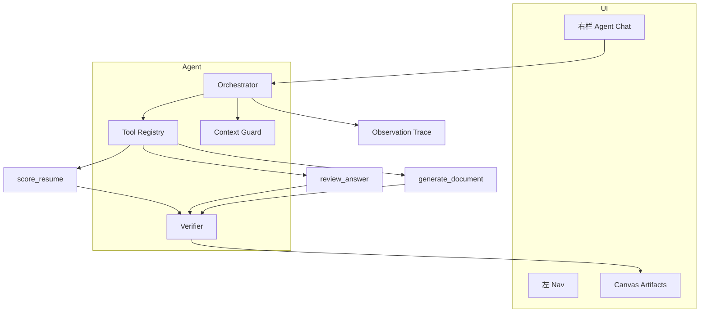

# CVassistant 3.0 — Agent 工作台方案

> 目标：Coze 式 **右栏对话 steer + 中间大画布产出 + 工具调用 + 文档交付**  
> 状态：**3.0-alpha 已上线**（`index.html` 三栏布局 + Canvas/Chat；Orchestrator 待 beta）

---

## 1. 现状 vs 目标

### 当前 UI（v2.x）

| 区域 | 现状 |
|------|------|
| 布局 | 单列 `max-width: 1080px`，`workspace-shell` 居中 |
| 模式 | 顶栏 Tab：`面试训练` / `简历优化` |
| 简历 | 左右双栏（评分 \| 优化）+ **底部**小追问条 |
| 面试准备 | 一键面板 `prepReport`，无独立对话区 |
| 业务场景 | 左模块 Nav + 中间「题目 / 作答 / 点评」三卡竖排 |
| Agent 感 | 无统一 Orchestrator；API 分散在 `chat` / `coach` / `plan` |

### 目标 UI（3.0）

| 区域 | 目标 |
|------|------|
| **左栏（窄，可选）** | 模块 / 会话 / 产物历史（~160–200px） |
| **中间（主画布，~62–68%）** | 结构化 Artifact：评分仪表盘、prep 报告、点评、**文档卡片** |
| **右栏（~28–32%）** | Agent 对话：下达指令、看 tool 步骤、简短确认 |
| **后端** | Orchestrator + Tool Registry，模型决定调哪个工具 |

---

## 2. 布局线框

### 桌面（≥ 1200px，推荐 72 / 28）

```
┌──────────────────────────────────────────────────────────────────────────┐
│  CVassistant · Hero(压缩) · 模式：Agent 工作台                            │
├─────────┬────────────────────────────────────────────┬───────────────────┤
│ 左 Nav  │           Center Canvas（Artifact）         │  Agent Chat       │
│ ~180px  │              ~65%                          │  ~30%             │
│         │                                              │                   │
│ · 简历  │  ┌─ Artifact Tabs ─────────────────────┐   │  [tool] 检索简历   │
│ · 面经  │  │ 评分报告 | 优化稿 | 文档            │   │  [tool] 改 bullet │
│ · 场景  │  └─────────────────────────────────────┘   │                   │
│ · 产物  │                                              │  User: 改第二点   │
│         │  ┌─ Score Dashboard ──────────────────┐   │  Agent: 已更新…   │
│         │  │ 过筛率 · 五维雷达 · topFixes        │   │                   │
│         │  └─────────────────────────────────────┘   │  ┌─────────────┐  │
│         │  ┌─ Document Card（类 Coze）──────────┐   │  │ 输入指令…   │  │
│         │  │ 📄 简历_v2.docx  [预览] [下载]      │   │  └─────────────┘  │
│         │  │ 变更：1. bullet 2 重写 …           │   │                   │
│         │  └─────────────────────────────────────┘   │  Agent Steps ▾    │
└─────────┴────────────────────────────────────────────┴───────────────────┘
```

### 平板 / 小屏

- 中间画布全宽；右栏 Chat 改为 **右侧抽屉** 或 **底部 40vh 面板**
- 一键按钮（评分 / 准备面试）保留在画布顶栏，不强迫先打字

### 比例建议

| 断点 | 左 Nav | Canvas | Chat |
|------|--------|--------|------|
| ≥ 1400px | 200px | flex 1（约 68%） | 360px 固定 |
| 1200–1399px | 180px | flex 1（约 65%） | 320px |
| < 1200px | 隐藏或汉堡菜单 | 100% | Drawer |

---

## 3. 和「不要对话气泡」如何兼容

之前产品原则是 **一键出结果、不要聊天机器人**。3.0 不是推翻，而是 **分工**：

| 角色 | 职责 | 用户看到什么 |
|------|------|--------------|
| **Canvas（主）** | 交付物 | 评分仪表盘、prep 报告、点评五维、Word 卡片 |
| **Chat（辅）** |  steering | 短指令：「改第二点」「换一题」「导出 docx」 |
| **Agent Steps（可选折叠）** | 可观测 | `[pick_question]` `[review]` `[generate_doc]`，类似 Coze |

原则：

1. **默认仍是一键**：首次「简历评分」「一键准备」→ 结果直接进 Canvas，Chat 只显示「已完成 · 3 个 tool」
2. **Chat 不承载长报告**：Assistant 在右侧最多 2–3 句摘要 + 文档卡片链接；全文在 Canvas
3. **结构化优先**：Canvas 渲染 `scoreReport` / `prepReport` JSON，不是 markdown 气泡
4. **可关闭 Chat**：纯练习模式隐藏右栏，等同 v2 业务场景

一句话：**Chat 是遥控器，Canvas 是电视屏。**

---

## 4. Artifact 类型（中间画布）

| Artifact ID | 来源 API / Tool | Canvas 组件 | 可导出 |
|-------------|-----------------|---------------|--------|
| `score-dashboard` | `score_resume` | 三维卡片 + 五维条 + topFixes | md / docx |
| `optimize-report` | `optimize_resume` | before/after bullets + 方向 | docx |
| `prep-report` | `prepare_interview` | opening / projects / followUps / badcases | docx / pdf |
| `review-panel` | `review_answer` | 五维点评 + 折叠 framework/rubric | md |
| `scenario-session` | `pick_question` + `submit_answer` | 题目卡 + 作答区 + 点评区（现有 sense 流） | — |
| `training-plan` | `create_plan` | steps 时间线（`/api/plan`） | md |
| `document` | `generate_document` | **文档卡片**：文件名、缩略预览、变更摘要、下载 | docx / pdf / md |
| `trace-inspector` | `get_trace` | Badcase 回溯（开发/评测模式） | json |

Artifact 状态存在 **Session State**（`localStorage` + 可选 Upstash），Orchestrator 每步更新 `activeArtifactId`。

---

## 5. Tool Catalog（Coze 式，对接现有 API）

### 5.1 设计原则

- 每个 Tool：`name` + `description` + `parameters (JSON Schema)` + `handler`
- Handler **复用**现有逻辑，不复制业务代码
- Orchestrator 单次 loop 最多 N 步（默认 5），每步 Verifier 校验

### 5.2 工具清单（MVP ~12 个）

| Tool | 说明 | 映射现有代码 |
|------|------|--------------|
| `get_profile` | 读用户简历/JD/目标岗 | `index.html` profile state |
| `update_profile` | 写 resume 字段（局部） | localStorage + optional sync |
| `score_resume` | 简历评分 | `POST /api/coach` `action: resume-score` |
| `optimize_resume` | 简历优化 | `action: resume-optimize` |
| `prepare_interview` | 面试准备报告 | `action: interview-prep` |
| `pick_question` | 从 218 题 / 模块选题 | `interview-bank` + topics |
| `submit_answer` | 提交作答 | 前端 state |
| `review_answer` | 五维点评 | `POST /api/chat` review |
| `analyze_extras` | 框架/标准/对比 | `POST /api/chat` `tool: analyze` |
| `rag_search` | 知识库/面经检索 | `lib/rag.js` |
| `create_plan` | 训练计划 | `POST /api/plan` |
| `generate_document` | 导出 docx/md/pdf | **新增** `lib/doc-generate.js` |
| `get_history` / `save_record` | 练习记录 | `POST /api/records` |
| `get_trace` | 观测回溯 | `POST /api/records` `recordType: traces` |

### 5.3 Orchestrator 入口（建议）

```
POST /api/agent
{
  "sessionId": "...",
  "message": "帮我把简历第二点改得更 AI PM 一点",
  "context": { "activeArtifact": "optimize-report", ... }
}

→ 流式 NDJSON：
  { "type": "tool_start", "tool": "optimize_resume", "args": {...} }
  { "type": "artifact_update", "artifactId": "...", "patch": {...} }
  { "type": "tool_start", "tool": "generate_document", ... }
  { "type": "document", "filename": "简历_v2.docx", "url": "/api/..." }
  { "type": "message", "text": "已更新第 2 条 bullet 并生成文档" }
  { "type": "done", "traceId": "..." }
```

可合并进现有 4 函数之一（如 `api/chat.js` 增 `mode: agent`），避免 Vercel 函数数量超限。

---

## 6. 文档生成路径（类截图 Word 卡片）

### 6.1 用户体验（对齐 Coze 截图）

1. Agent 调用 `generate_document`
2. Canvas 出现 **Document Card**：
   - 左侧：文件类型图标（W / PDF / MD）
   - 标题：`简历_v2_20260627.docx`
   - 右侧：缩略预览（首页 HTML→canvas 或静态模板图）
   - 下方：**变更摘要** 编号列表（3–5 条）
3. 点击 → 下载或在新 tab 预览

### 6.2 技术方案对比

| 格式 | 推荐方案 | 运行位置 | Vercel 友好 |
|------|----------|----------|-------------|
| **Markdown** | 模板字符串 + `marked` 渲染 | 客户端 / Edge | ✅ |
| **DOCX** | [`docx`](https://www.npmjs.com/package/docx) 组装段落/表格 | **Node Serverless**（非 Edge） | ⚠️ 需 `runtime: nodejs`，注意 10s |
| **PDF** | 方案 A：`docx` → 云端 LibreOffice（重） | 外部服务 | ❌ Hobby 不适合 |
| | 方案 B：**打印 CSS** + 浏览器「另存 PDF」 | 客户端 | ✅ 零后端 |
| | 方案 C：`pdf-lib` 简单纯文本 PDF | Edge/Node | ✅ 样式简陋 |
| **预览缩略图** | HTML artifact → `html2canvas` 客户端 | 客户端 | ✅ |

### 6.3 推荐 MVP 路径

1. **Phase 1**：Markdown artifact + 浏览器下载 `.md`；Canvas 文档卡片 + 变更摘要
2. **Phase 2**：`generate_document` Node 函数生成 **docx**（简历评分/优化/prep 三套模板）
3. **Phase 3**：可选 PDF（客户端 print 或付费转换 API）

**存储**：生成文件 → 短期 Blob URL（内存）或 Upstash / Vercel Blob（需配置）；单人使用可先 **base64 直传前端下载**，不落盘。

### 6.4 Vercel 约束

- 文档生成放 **Node runtime**（`docx` 包），`maxDuration` 尽量合并为一次 LLM + 一次 docx
- 大简历 + 多 tool 串行 → **本地 `vercel dev` 完整体验**，线上限制步数（≤3 tool / 请求）

---

## 7. 交互流示例

**场景**：用户已在 Canvas 看到优化报告，想在 Chat 里说「帮我把第二点改得更像 AI PM，并给我 Word」。

```
User (右栏): 帮我把简历第二点改得更 AI PM，导出 Word

Agent 内部:
  1. get_profile()           → 读 resume + 当前 optimizeReport
  2. optimize_resume({        → POST /api/coach
       focus: "bullet index 2",
       instruction: "AI PM 信号：eval/badcase/指标"
     })
  3. Verifier                 → JSON 含 bullets[1].after
  4. generate_document({       → lib/doc-generate
       template: "resume-optimize",
       data: optimizeReport
     })
  5. persist trace             → observation-trace

Canvas 更新:
  · optimize-report artifact 刷新 before/after
  · 新增 document card「简历_v2.docx」+ 3 条变更摘要

Chat 回复:
  · 「已重写第 2 条 bullet，强调 eval 闭环；文档已生成 ↓」
  · 小卡片链接（不是整篇正文）
```

---

## 8. 分期 rollout

### 3.0-alpha（布局 + 状态）— **已完成**

- [x] 三栏 CSS Grid 壳层（Nav / Canvas / Chat）
- [x] Artifact 状态机 + Tab 切换（score/prep/review 组件挂 Canvas）
- [x] 右栏 Chat UI（消息 + tool steps 折叠；小屏 Drawer）
- [x] 现有「一键评分/准备」→ 写 Canvas，Chat echo 摘要
- [x] **不改** Orchestrator，前端直连现有 API（`/api/chat` · `/api/coach` · `/api/plan` · `/api/records`）

### 3.0-beta（Agent + Tools，3–4 周当量）

- [ ] `lib/tool-registry.js` + `POST /api/agent` loop
- [ ] 12 个 Tool handler 包装现有 API
- [ ] Verifier（parse + schema）+ Trace 每步打标
- [ ] Chat 指令驱动 Canvas 更新（「改第二点」「换一题」）
- [ ] Context Guard 接入 agent session history

### 3.0-rc（文档 +  polish）

- [ ] `generate_document` → docx + Document Card UI
- [ ] 产物历史侧栏（左 Nav「产物」）
- [ ] 移动端 Drawer Chat
- [ ] Golden Set eval 与 Agent Trace 打通（badcase → 一键打开对应 session）

---

## 9. 架构图（运行时）



---

## 10. 待你确认的 5 个问题

1. **左 Nav 要不要保留？**  
   - A) 三栏：Nav + Canvas + Chat  
   - B) 两栏：Canvas + Chat，模式切换放顶栏（更省横向空间）

2. **右栏 Chat 默认展开吗？**  
   - 桌面默认展开（steer 随时可用）  
   - 还是默认收起，一键结果后再打开？

3. **文档格式的优先级？**  
   - 必须先 **docx**（对齐截图）  
   - 还是 **md 下载 + 浏览器 PDF** 即可 MVP？

4. **Agent 跑在哪？**  
   - 线上 Vercel 轻量（≤3 tool/次，无 docx）  
   - 完整 Agent + docx **仅本地**  
   - 还是升级 Vercel Pro 换 60s？

5. **第一个 Agent 打样场景？**  
   - 简历优化 + 文档导出（和你截图最接近）  
   - 业务场景（出题→点评→追问）  
   - 面试准备一条龙

---

## 11. 相关文件（实现时会动）

| 文件 | 变更 |
|------|------|
| `index.html` | 三栏布局、Canvas/Chat 组件、Artifact 状态 |
| `api/agent.js` 或 `api/chat.js` | Orchestrator 入口 |
| `lib/tool-registry.js` | Tool 定义与 dispatch |
| `lib/doc-generate.js` | docx/md 生成 |
| `lib/observation-trace.js` | 每 tool 一步 trace |
| `lib/context-guard.js` | Agent session 压缩 |

---

*文档版本：v0.2 · alpha 已交付 · beta（Orchestrator + docx）进行中*
